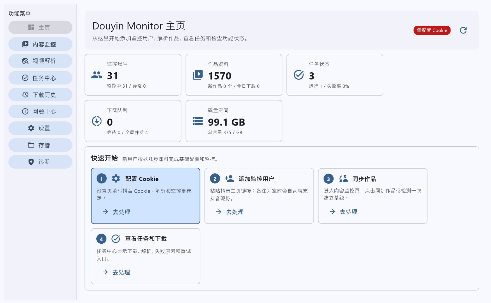
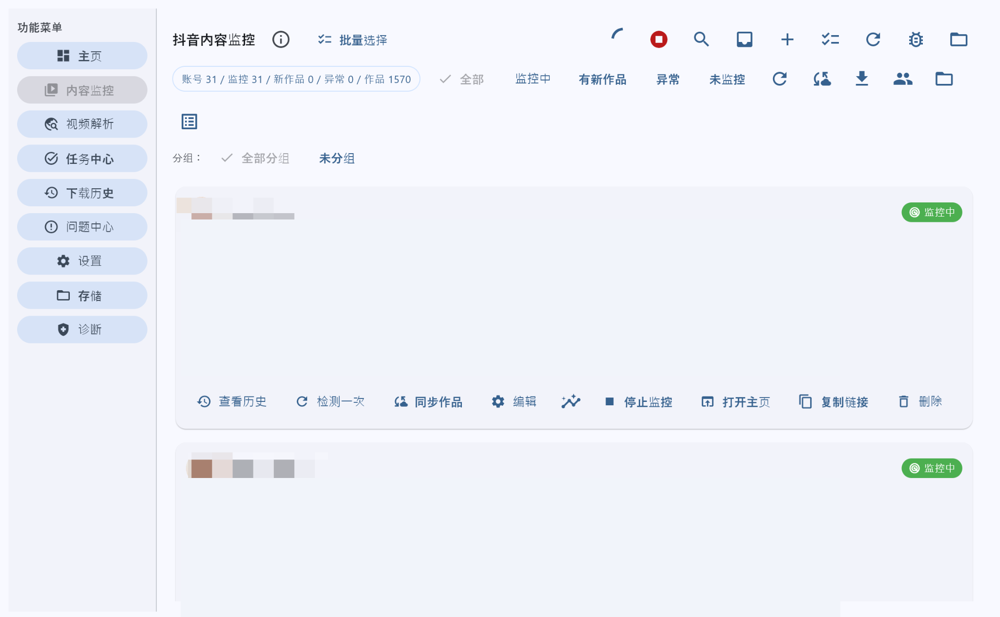
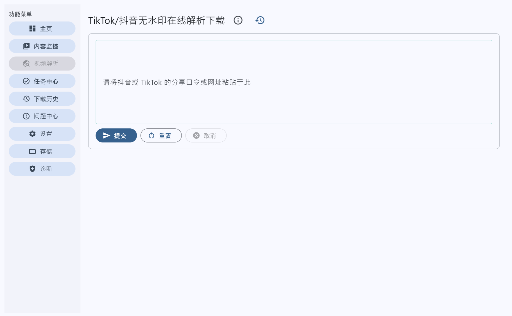

# douyin_monitor

一个本地运行的 Douyin/TikTok 内容监控与无水印解析下载工具。项目基于 Python + Flet 构建桌面界面，支持抖音公开主页作品监控、批量同步作品、视频/图集解析、下载队列、任务中心、下载历史、问题诊断和 Windows exe 打包。

> 本项目仅用于用户主动提供的公开链接或有权访问的内容。请自行确认使用场景符合平台规则、法律法规和内容授权边界。Cookie、账号、下载记录、解析历史等运行数据只应保存在本地，不应提交到 GitHub。


## 最新版本提示

当前版本：`1.0.2`。本版本继续修复 Win 端问题中心灰块/空白问题：问题中心改为保守控件布局，切页增加异常兜底，避免页面加载失败后主区域空白。GitHub 包已清理缓存、日志、运行数据、测试缓存和字体二进制文件，更适合直接提交源码仓库。

## 界面预览

### 首页仪表盘



### 抖音内容监控



### 作品同步与下载


### TikTok/抖音无水印解析



### 媒体预览


## 核心功能

- 抖音主页监控：添加公开主页链接后，定时检测作品更新并维护作品基线。
- 批量账号管理：支持监控中、未监控、有新作品、异常等状态筛选。
- 作品同步：按账号同步作品资料，支持视频、图集、新作品、未下载、已下载、失败等分类查看。
- 无水印解析：支持粘贴 Douyin/TikTok 分享口令或网址进行解析。
- 下载管理：提供下载队列、任务中心、下载历史、失败原因提示和重试入口。
- Cookie 池：可在设置页本地配置一个或多个 Douyin Cookie，用于轮换、冷却和提升稳定性。
- 本地存储：使用 SQLite/JSON 保存本地运行状态，便于备份、迁移和清理。
- 诊断工具：内置环境检查、磁盘空间检查、运行状态检查和常见问题提示。
- Windows 打包：提供脚本生成可独立运行的 Windows exe、便携 zip、Inno Setup 安装包和自动更新清单。

## 项目结构

```text
douyin_monitor/
├─ app/                         # 桌面应用、业务逻辑、UI 页面
├─ crawlers/                    # 内置 Douyin/TikTok 解析器
├─ config/                      # 默认配置与语言配置
├─ docs/                        # 文档与 README 截图
├─ locales/                     # 中英文界面文案
├─ packaging/windows/           # PyInstaller / Inno Setup 打包配置
├─ scripts/                     # 检查、迁移、维护、测试、发布脚本
├─ tests/                       # 单元测试
├─ build_exe_windows.bat        # Windows 一键生成 exe
├─ install_windows.bat          # Windows 安装依赖
├─ run_windows.bat              # Windows 启动应用
└─ main.py                      # 程序入口
```


## GitHub 源码提交说明

本仓库应只提交源码、默认配置、文档、测试和部署脚本。不要提交本地运行数据。

已从 GitHub 包中清理的内容包括：

- `__pycache__/`、`.pytest_cache/`、`.ruff_cache/`、`.mypy_cache/` 等缓存。
- `scripts/logs/`、`logs/`、`data/`、`downloads/`、`diagnostics/` 等运行输出。
- `config/cookies.json`、`config/accounts.json`、`config/web_auth.json`、`config/cookie_health.json` 等本地状态。
- `.env`、Docker 本地 Token、Cookie、下载文件、备份文件。
- 字体二进制文件。应用找不到内置字体时会自动使用系统默认字体。

提交前建议执行：

```bash
git status
git check-ignore -v data downloads .env config/cookies.json || true
```

## 环境要求

- Windows 10/11 推荐
- Python 3.10 - 3.12
- 建议使用虚拟环境运行

Python 安装时建议勾选 `Add Python to PATH`。

## Windows 快速运行

首次安装依赖：

```bat
install_windows.bat
```

启动桌面应用：

```bat
run_windows.bat
```

如果想在启动前检查运行环境：

```bat
run_windows_checked.bat
```

## 手动运行

```bash
python -m venv .venv
```

Windows：

```bat
.venv\Scripts\activate
python -m pip install --upgrade pip
python -m pip install -r requirements.txt
python main.py
```

Linux/macOS：

```bash
source .venv/bin/activate
python -m pip install --upgrade pip
python -m pip install -r requirements.txt
python main.py
```

## Cookie 与本地数据

应用可以不配置 Cookie 启动，但解析和监控稳定性可能受平台风控影响。推荐只在桌面应用的“设置”页本地填写：

- 抖音 Cookie
- TikTok Cookie
- 多个抖音 Cookie 可按行填写，系统会做基础清洗、轮换和异常冷却

以下内容属于本地运行数据，不要提交到 GitHub：

- `config/accounts.json`
- `config/cookies.json`
- `config/cookies.secure.json`
- `config/douyin_content_monitor.json`
- `config/parse_history.json`
- `config/task_records.json`
- `config/user_settings.json`
- `data/`
- `logs/`
- `cache/`
- `downloads/`
- `diagnostics/`
- `.env`
- `.venv/`
- `build/`
- `dist/`

这些路径已写入 `.gitignore`。如果不小心生成过本地数据，上传前请重新检查 `git status`。

## 清理本地运行数据

预览将被清理的文件：

```bash
python scripts/clear_local_data.py
```

确认清理配置、Cookie、诊断等本地数据：

```bash
python scripts/clear_local_data.py --yes
```

同时清理 SQLite 数据库：

```bash
python scripts/clear_local_data.py --yes --include-database
```

同时清理日志：

```bash
python scripts/clear_local_data.py --yes --include-logs
```

下载目录默认不会被脚本删除，避免误删用户媒体文件。

## 生成 Windows exe

在 Windows 上执行：

```bat
build_exe_windows.bat
```

生成结果：

```text
dist\DouyinMonitor\DouyinMonitor.exe
```

如果需要跳过脚本末尾的暂停：

```bat
build_exe_windows.bat --no-pause
```

更严格的发布流程：

```bat
build_windows_release.bat --skip-tests
```

如需生成安装包，需要先安装 Inno Setup，并确保 `ISCC.exe` 在 PATH 中：

```bat
build_windows_release.bat --installer --portable-zip --manifest --skip-tests
```

正式发布可同时启用代码签名。签名证书通过环境变量配置，详见 `docs/INSTALLER_AUTO_UPDATE_SIGNING_CICD.md`：

```bat
build_windows_release.bat --installer --portable-zip --manifest --sign --skip-tests
```

生成结果包括：

```text
dist\DouyinMonitor\DouyinMonitor.exe
dist\DouyinMonitor-<version>-windows-x64-portable.zip
dist\installer\DouyinMonitorSetup-<version>.exe
dist\update_manifest.json
```

## 测试与检查

基础检查：

```bash
python scripts/smoke_check.py --strict
```

运行测试：

```bash
python scripts/run_tests.py
```

创建安全源码发布包：

```bash
python scripts/package_release.py
```

执行完整发布闸门：

```bash
python scripts/release_gate.py --package --name douyin_monitor_release.zip
```

GitHub Actions 已提供 CI 和 Windows Release 自动发布流程：

```text
.github/workflows/ci.yml
.github/workflows/release.yml
```

## GitHub 上传前检查清单

上传前建议确认：

- 不包含 `.git/`、`.venv/`、`build/`、`dist/`。
- 不包含 `.env`、真实 Cookie、账号列表、监控记录、解析历史、任务记录。
- 不包含 `data/`、`logs/`、`cache/`、`downloads/`、`diagnostics/`。
- 不包含 `__pycache__/`、`.pytest_cache/`、`.ruff_cache/`。
- `crawlers/*/config.yaml` 中的 `Cookie`、`msToken`、`ttwid.cookie` 等字段为空或由运行时生成。
- README 截图中不暴露真实账号、Cookie、私密链接或下载路径。

## 更新到 GitHub

如果远程仓库已经存在：

```bash
git clone git@github.com:Syuanya/douyin_monitor.git
cd douyin_monitor
```

把本项目文件复制到仓库目录后执行：

```bash
git status
git add .
git commit -m "Update douyin monitor project"
git push origin main
```

如果当前远程仓库使用 `master` 分支，请把最后一行改成：

```bash
git push origin master
```

如果是第一次初始化仓库：

```bash
git init
git branch -M main
git remote add origin git@github.com:Syuanya/douyin_monitor.git
git add .
git commit -m "Initial commit"
git push -u origin main
```

## 风险说明

更完整的隐私和平台风险说明见 [docs/PRIVACY_AND_RISK.md](docs/PRIVACY_AND_RISK.md)。
